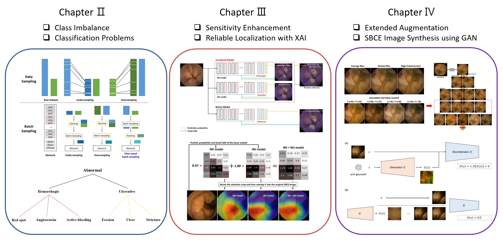
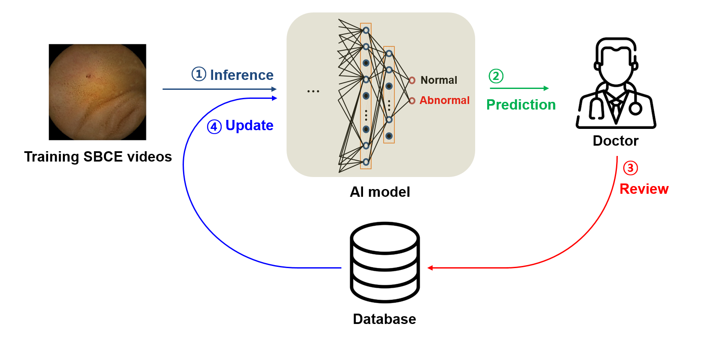

# Introduction

CNN-based small bowel lesion classification and XAI-based localization

- DL Platform conversion Tensorflow to Pytorch
- Jupyter notebooks for understanding in each phase and code modularization for usability
- Separte model development and video analysis
- Including experiments for master's thesis (Yunseob Hwang - Convolutional Neural Network Based Small Bowel Lesion Detection in Capsule Endoscopy, POSTECH, 2021)

# Thesis

     

 

- Chapter 4

MSG-GAN was utilized to synthesize fake SBCE samples (https://github.com/akanimax/BMSG-GAN)

     <b> GAN training lapse </b> 
     

 

     <b> GAN synthesized samples </b> 
     

# *AI feedback Process
- AI model's inference can be used to collect training samples rapidly with reducing Experts' labeling cost 
- Eventually, it implies that this process could allow the AI model to be robust for itself
- Extended AI Research Fields: Active Learning, Online Learning, Continual Learning, AutoML...
- Related Work: Closing the Human-Data-AI Loop (https://sites.google.com/lunit.io/lunit-research-engineer/%EB%AC%B4%EC%97%87%EC%9D%84-%EB%A7%8C%EB%93%A4%EA%B2%8C-%EB%90%98%EB%82%98%EC%9A%94?authuser=0)

     

 
