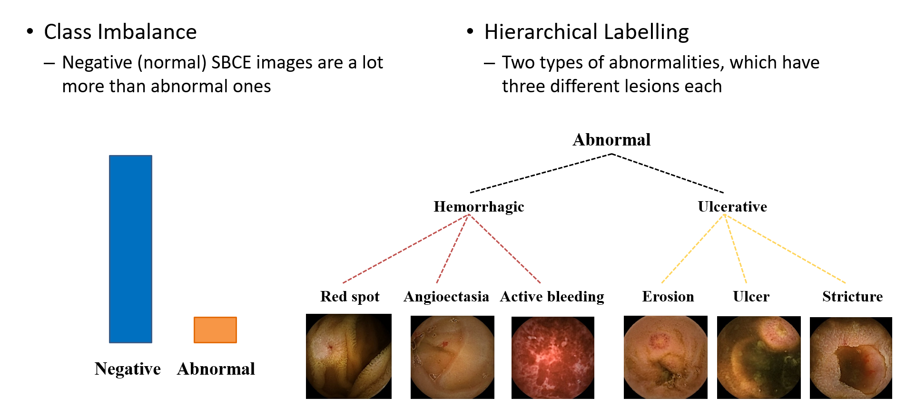

# Introduction

CNN-based small bowel lesion classification and XAI-based localization

- DL Platform conversion Tensorflow to Pytorch
- Jupyter notebooks for understanding in each phase and code modularization for usability
- Separte model development and video analysis
- Including experiments for master's thesis (Yunseob Hwang - Convolutional Neural Network Based Small Bowel Lesion Detection in Capsule Endoscopy, POSTECH, 2021)

# *Thesis

# Chapter 2: Small Bowel Lesion Detection using CNNs

     <b> Class Imbalance and Hierachical Labeling</b>  
     

 

     <b> Sampling Methods for Class Imbalance</b>  
     

 
